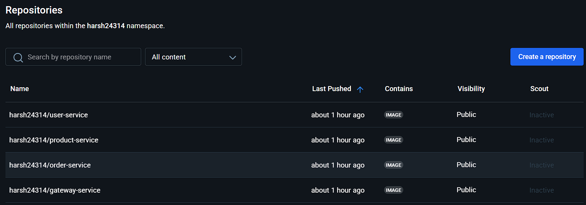
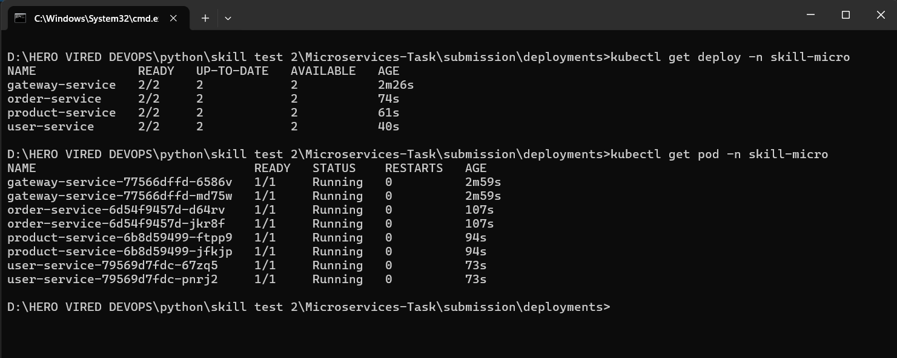
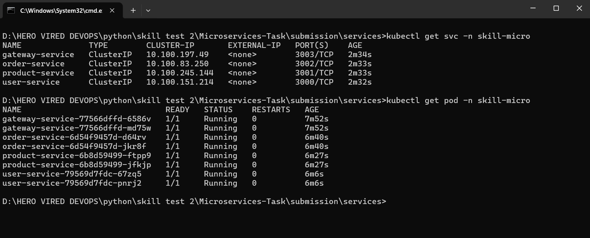

# Microservices-Task

## Overview
This document provides details on testing various services after running the `docker-compose` file. These services include User, Product, Order, and Gateway Services. Each service has its own endpoints for testing purposes.

---

## Services and Endpoints

### **User Service**
- **Base URL:** `http://localhost:3000`
- **Endpoints:**
  - **List Users:**  
    ```
    curl http://localhost:3000/users
    ```
    Or open in your browser: [http://localhost:3000/users](http://localhost:3000/users)

---

### **Product Service**
- **Base URL:** `http://localhost:3001`
- **Endpoints:**
  - **List Products:**  
    ```
    curl http://localhost:3001/products
    ```
    Or open in your browser: [http://localhost:3001/products](http://localhost:3001/products)

---

### **Order Service**
- **Base URL:** `http://localhost:3002`
- **Endpoints:**
  - **List Orders:**  
    ```
    curl http://localhost:3002/orders
    ```
    Or open in your browser: [http://localhost:3002/orders](http://localhost:3002/orders)

---

### **Gateway Service**
- **Base URL:** `http://localhost:3003/api`
- **Endpoints:**
  - **Users:**  
    ```
    curl http://localhost:3003/api/users
    ```
  - **Products:**  
    ```
    curl http://localhost:3003/api/products
    ```
  - **Orders:**  
    ```
    curl http://localhost:3003/api/orders
    ```

---

## Instructions
1. Start all services using the `docker-compose` file:
   ```
   docker-compose up
   ```
2. Once the services are running, use the above endpoints to verify the functionality.

Happy testing!

# Deploying microservices using Kubernets
we will deploy microservices using EKS clustor and using minikube 

## Task we will cover
- [x] Containerised each microservices
- [x] Tag and push all build image to the docker hub
- [x] File structure for kubernets setup
- [x] Test endpoints

### Containersied microservices and Push image to Docker Hub
- Add `Dockerfile` in each microservice folder
- Build and push all images using `bash script` [bash script for push](Microservices/build-and-push.sh)
- Screenshort   
  

### File structure for kubernets setup
'''deployments
  gateway-service.yaml
  order-service.yaml
  product-service.yaml
  user-service.yaml
'''
'''services
  gateway-service.yaml
  order-service.yaml
  product-service.yaml
  user-service.yaml
'''
### Run and Test
- Deployment running    
 

- Service running   
  


